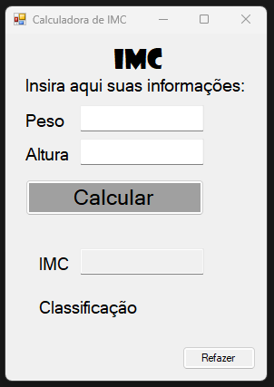
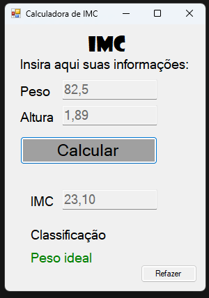

# 🧮 Calculadora de IMC - Windows Forms (C#)

Este projeto foi desenvolvido em **C# utilizando Windows Forms**, com o objetivo de criar uma **calculadora de IMC (Índice de Massa Corporal)** com uma interface gráfica simples, intuitiva e funcional.

O programa permite ao usuário inserir seu **peso** e sua **altura**, e ao clicar no botão **"Calcular"**, o sistema realiza o cálculo do IMC e exibe tanto o **valor do IMC** quanto a **classificação correspondente** (como "Peso normal", "Sobrepeso", etc.). Também conta com validações de segurança e a opção de realizar um novo cálculo.

---

## ✅ Funcionalidades

- Campo para inserir o **peso** (em kg)
- Campo para inserir a **altura** (em metros)
- Botão **"Calcular"** para executar o cálculo do IMC
- Exibição do **valor do IMC**
- Exibição da **classificação do IMC**
- **Validação** para impedir campos vazios ou com dados inválidos
- Botão **"Calcular Novamente"** para limpar os campos e permitir novo cálculo

---

## 🔒 Validações de Segurança

- Ambos os campos (**peso** e **altura**) são obrigatórios.
- O programa exibe mensagens de erro se algum campo estiver vazio ou com um valor inválido.
- Apenas valores numéricos positivos são aceitos.

---

## 🧠 Cálculo do IMC

A fórmula utilizada para o cálculo é:
IMC = peso / (altura * altura)

O resultado é exibido com duas casas decimais.

---

## 📊 Classificação do IMC

| IMC (kg/m²)       | Classificação           |
|------------------|-------------------------|
| Menor que 18,5   | Abaixo do peso          |
| 18,5 – 24,9      | Peso normal             |
| 25,0 – 29,9      | Sobrepeso               |
| 30,0 – 34,9      | Obesidade grau I        |
| 35,0 – 39,9      | Obesidade grau II       |
| 40,0 ou mais     | Obesidade grau III      |

---

## 🖼️ Imagens do Programa

### 📌 Tela Inicial

### 📌 Resultado do Cálculo

---

## 🚀 Como Executar

1. Abra o projeto no **Visual Studio**.
2. Compile a solução com `Ctrl + Shift + B`.
3. Execute o programa pressionando `F5` ou clicando em **Iniciar**.
4. Insira o peso e a altura nos campos correspondentes.
5. Clique em **"Calcular"** para ver o resultado.
6. Clique em **"Calcular Novamente"** para reiniciar os campos e fazer um novo cálculo.

## 📁 Estrutura do Projeto

CalculadoraIMC/
├── CalculadoraIMC.sln # Solução do Visual Studio
├── Form1.cs # Código do formulário principal
├── Form1.Designer.cs # Layout do formulário
├── Program.cs # Ponto de entrada do programa
├── print1.png # Print da tela inicial
├── print2.png # Print com resultado do IMC
└── README.md # Descrição do projeto

---

## 📝 Licença

Este projeto está licenciado sob a **MIT License**. Livre para uso pessoal e educacional.

---

